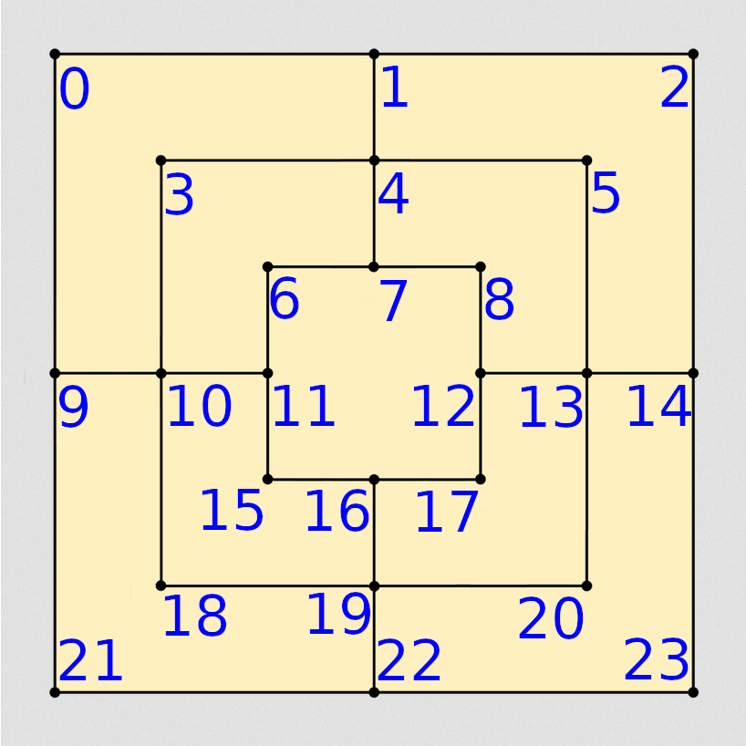

# Developer Notes

## Documentation
The documentation is done through docstrings for functions using built-in java tool `javadoc`. If you are in the project root directory, then then following command will regenerate the necessary docs. 

	javadoc -d ./docs -sourcepath ./src -subpackages main

## Testing
The tests for this project are written for JUnit, which is specified in the project file. If you use the standard `Java` extensions for Visual Studio Code or base installation of Eclipse, you can run these. In VSCode, go to the test panel and click run. In eclipse, right-click on the package or file and click Run As, then select "Run As: JUnit Tests".

## Board Structure
For simiplicity's sake, the board is represented by a 1D array 24 elements long consisting of byte objects (primitive integer with values -128 through 127, inclusive). Each element represents a possible board location, and the folloing will mark the possible states of a location:
- ```0``` means the location is empty
- ```1``` means that player one has a piece here
- ```2``` means that player two has a piece here
The numbering system corresponds to the following picture. 

NOTE: Arrays start at zero, for generality, this picture starts at one.


