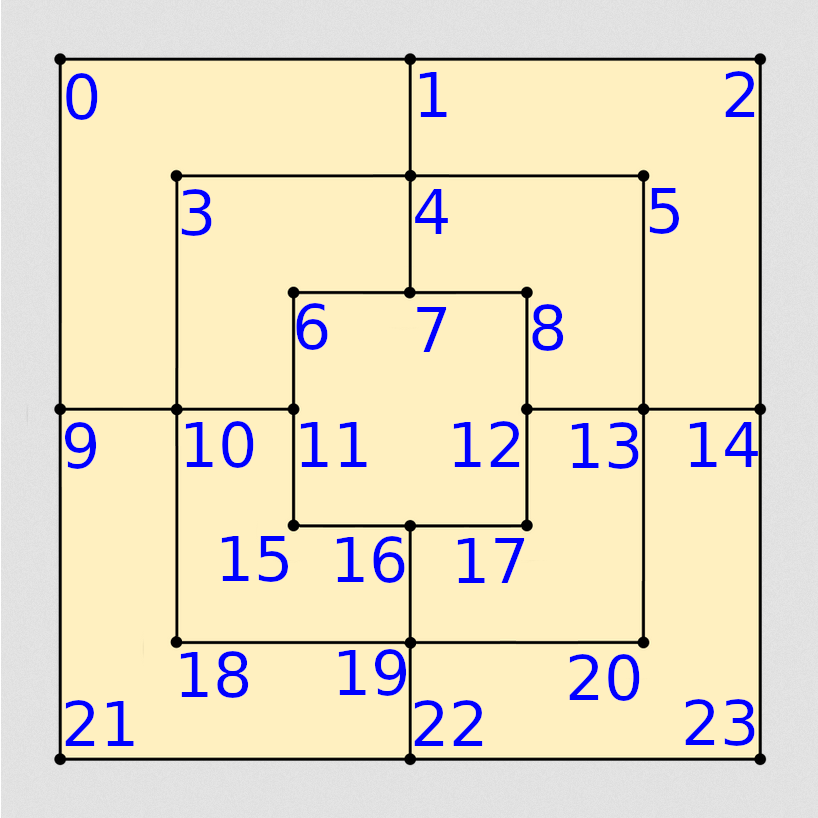

# Developer Notes about the Board and Game Structure
## Board
For simiplicity's sake, the board is represented by a 1D array 24 elements long consisting of byte objects (primitive integer with values -128 through 127, inclusive). Each element represents a possible board location, and the folloing will mark the possible states of a location:
- ```0``` means the location is empty
- ```1``` means that player one has a piece here
- ```2``` means that player two has a piece here
The numbering system corresponds to the following picture. 

NOTE: Arrays start at zero, for generality, this picture starts at one.


